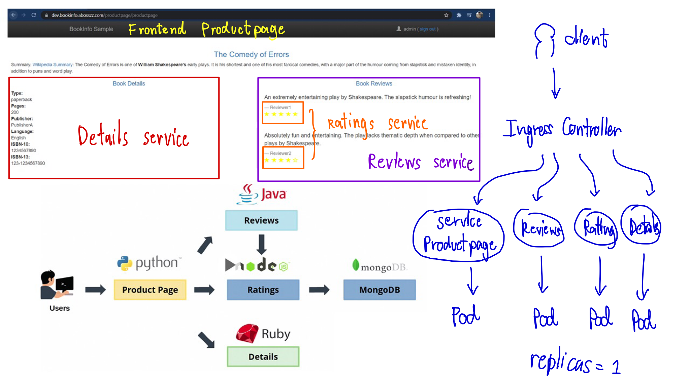

# Kubernetes Workshop By Skooldio (Opsta Education Co.,Ltd.)

Workshop is deploy 4 microservices using kubernetes. This workshop use GKE for deployment.

## Docker Container for this workshop By opsta

* docker pull opsta/bookinfo-ratings:latest
* docker pull opsta/bookinfo-productpage:latest
* docker pull opsta/bookinfo-details:latest
* docker pull opsta/bookinfo-reviews:latest

# Workshop

